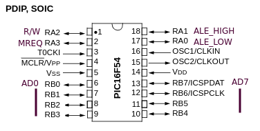

# psiche - a PIC16F54-based 8-bit CPU

This work-in-progress project aims to use the old PIC16F54 as a replacement for a general-purpose 8-bit microprocessor.  

## Features

- 64 KiB address space  
- 45 instructions  
- 16-bit stack and data pointers  

## Pinout



```
R/W     : read(low)/write(high) signal
MREQ    : active-high signal that indicates that an access to memory is requested at the location stored in the address latches

ALE_LOW : address latch enable (low-order byte)
ALE_HIGH: address latch enable (high-order byte)
Those signals must be wired to a latch (edge or level triggered) that will provide the address lines.

AD0-AD7 : multiplexed address and data
```

## Contents

```
assembler - an assembler based on asm6502
doc - an opcode table
pic - the program for the PIC16F54
tests - some test programs
```

